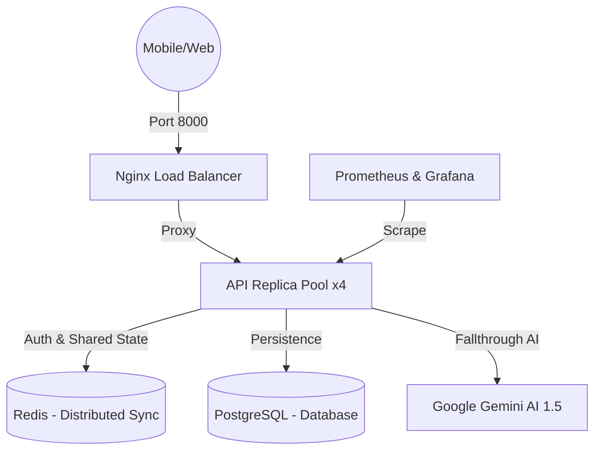

# MataCeria Backend 

[](https://github.com/faiz-jihad/MataCeria/actions)
[](https://fastapi.tiangolo.com/)
[](https://www.docker.com/)
[](LICENSE)

Sistem backend cerdas berbasis AI untuk **MataCeria** — Platform asisten kesehatan mata pintar dan deteksi dini refraksi (Miopia). Dirancang untuk skalabilitas tinggi, keamanan berlapis, dan efisiensi sumber daya maksimal.

---

##  1. ARSITEKTUR SISTEM 

Sistem MataCeria V2 mengimplementasikan pola **Micro-instance Auto-scaling** yang didukung oleh Nginx sebagai Load Balancer.



---

## 🚀 2. FITUR UNGGULAN PRODUKSI

- 🧬 **Hybrid AI Inference**: Mendukung **ONNX Runtime** (Ultra-Lightweight) untuk performa inferensi 10x lebih cepat dan hemat RAM.
- ⚖️ **Dynamic Scalability**: Berjalan secara paralel dalam 4 kontainer untuk menjamin ketersediaan layanan (*High Availability*).
- 🛡️ **Hardened Security**: Penutupan port publik (DB/Redis), proteksi HSTS, dan penggunaan *Non-Root User* di Docker.
- 🚄 **Distributed Rate Limiting**: Sinkronisasi pembatasan trafik global antar replika menggunakan Redis.

---

## 📖 3. PUSAT DOKUMENTASI (PRODUCTION-GRADE)

Dokumentasi lengkap untuk berbagai kebutuhan operasional tersedia di folder `docs/`:

| Dokumen | Target Pembaca | Konten Utama |
| :--- | :--- | :--- |
| **[Developer Guide](docs/DEVELOPMENT_GUIDE.md)** | Developer Backend | Onboarding, Standards, Local Setup, & Testing. |
| **[API Guide](docs/API_GUIDE.md)** | Developer Mobile | Detil Endpoint V1/V2, Skema JSON, & Errors. |
| **[Operations Guide](docs/OPERATIONS_GUIDE.md)** | DevOps / Admin | Scaling, Nginx, Infrastructure, & CI/CD. |
| **[Maintenance Guide](docs/MAINTENANCE_GUIDE.md)** | SysAdmin / Security | Backup, Recovery, Log, & Security Hardening. |

---

## ⚙️ 4. CARA INSTALASI CEPAT

1. **Persiapan Environmet**:
   ```bash
   cp .env.example .env
   ```
2. **Jalankan Sistem**:
   ```bash
   docker compose up -d --build
   ```
3. **Inisialisasi Data Dasar (WAJIB)**:
   ```bash
   docker compose exec -T api python -m scripts.seed_data
   docker compose exec -T api python -m scripts.seed_regional_data
   ```

---

## 🧪 PENGUJIAN & MONITORING
- **Unit & Integration Test**: `docker compose exec -T api pytest tests/`
- **Dashboard Grafana**: `http://localhost:3001` (admin/admin)
- **API Swagger Docs**: `http://localhost:8000/docs`

---
Developed with ❤️ by the MataCeria Team.
**Vision for Everyone.**
