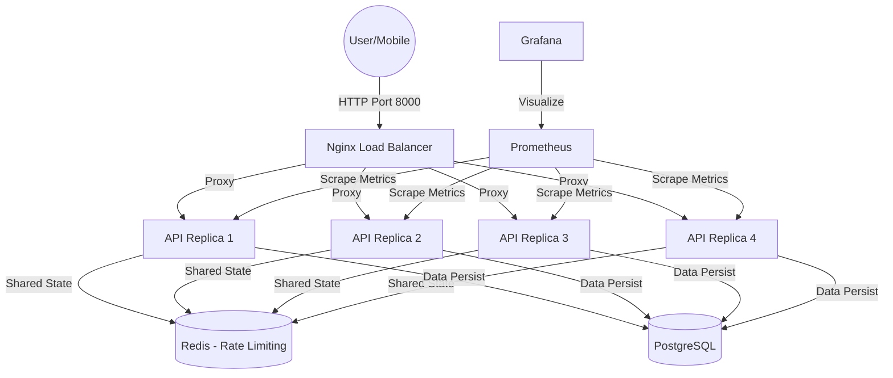

# 🏗️ Arsitektur & Scaling MataCeria

Dokumen ini menjelaskan bagaimana sistem backend MataCeria dirancang untuk keandalan tinggi dan efisiensi sumber daya di lingkungan produksi.

---

## 🛰️ 1. DIAGRAM ALIR TRAFIK

---

## 🚀 2. KOMPONEN UTAMA

| Komponen | Peran Utama |
| :--- | :--- |
| **Nginx** | Berperan sebagai Reverse Proxy dan Load Balancer. Menangani kompresi Gzip dan Caching file. |
| **FastAPI Replicas** | 4 instance kontainer yang berjalan secara paralel untuk menangani beban tinggi. |
| **Redis** | Digunakan untuk sinkronisasi *Rate Limiting*. Tanpa Redis, tiap replika akan memiliki hitungan kuota sendiri-sendiri (inkonsisten). |
| **PostgreSQL** | Database relasional untuk menyimpan data pengguna, hasil tes, dan artikel. |

---

## ⚡ 3. OPTIMASI "ULTRA-LIGHTWEIGHT"

Sistem ini didesain agar tidak membebani server (hemat RAM) melalui teknik:
- **ONNX Runtime (OR)**: Menggunakan engine ONNX untuk inferensi AI yang 10x lebih hemat memori dibanding TensorFlow.
- **Multi-stage Build**: Docker image tetap kecil karena compiler (*gcc*) hanya ada saat tahap build saja.
- **Resource Limits**: Tiap replika API dibatasi maksimal 1GB RAM untuk mencegah satu proses AI memakan seluruh memori server (16GB).

---

## 📊 4. MONITORING
- **Grafana**: Tersedia di port **3001** untuk melihat statistik performa secara real-time.
- **Prometheus**: Mengumpulkan data penggunaan API dari setiap instansi kontainer.
