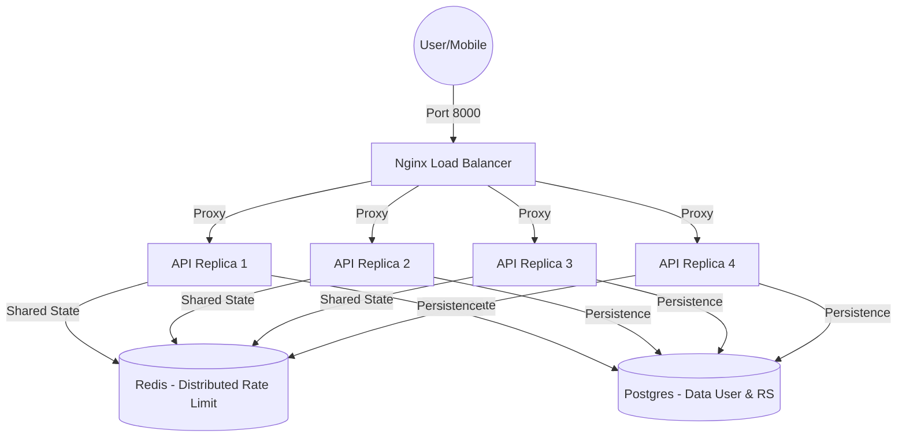

# 🏗️ Panduan Infrastruktur & Scaling: MataCeria Production

Dokumen ini merinci arsitektur teknis sistem backend MataCeria untuk lingkungan produksi yang skalabel dan andal.

---

## 🛰️ 1. DESAIN ARSITEKTUR (LOAD BALANCING)

Sistem menggunakan **Nginx** sebagai pintu masuk tunggal (Single Entry Point) yang mendistribusikan beban trafik ke 4 replika API.

---

## ⚡ 2. KETERSEDIAN TINGGI (HIGH AVAILABILITY)

| Komponen | Mekanisme Scaling |
| :--- | :--- |
| **Replika API** | Berjalan 4 instance (`replicas: 4`). Jika 1 kontainer mati, Nginx akan memindahkan trafik ke 3 kontainer lain secara otomatis. |
| **Shared Storage** | Redis bertindak sebagai sinkronisasi global untuk pembatasan kuota (*Rate Limiting*) agar user tidak mendapatkan kuota berlebih hanya karena berpindah kontainer. |
| **Restart Policy** | Semua layanan (`api`, `db`, `redis`, `nginx`) memiliki kebijakan `restart: always`. |

---

## 🖥️ 3. OPTIMASI RESOURCE DOCKER

Untuk server dengan RAM 16GB, alokasi per replika API diatur secara aman:
- **Limit CPU**: 0.5 (Setengah Core).
- **Limit RAM**: 1024MB (1GB).
- **Reservation RAM**: 256MB.

Optimasi tambahan:
- **MALLOC_ARENA_MAX=2**: Mengurangi fragmentasi memori Python.
- **Gzip Compression**: Mengurangi beban bandwidth hingga 70% pada transfer data JSON.

---

## 🌡️ 4. MONITORING INFRASTRUKTUR

Sistem dilengkapi dengan **Prometheus** dan **Grafana** untuk memantau kesehatan server secara real-time:
- **Metrik API**: Jumlah request per detik, waktu respon rata-rata, persentase error.
- **Metrik Sistem**: Penggunaan CPU/RAM tiap replika kontainer.
- **Grafana URL**: `http://localhost:3001` (Akses internal/publik sesuai config).

---
*Arsitektur ini dirancang untuk menangani hingga ribuan pengguna aktif harian.* 🚀
